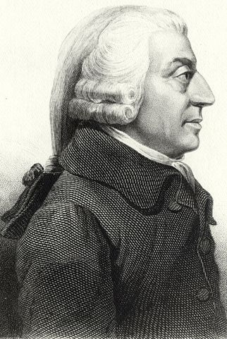

# Wealth, welfare, scarcity, growth-oriented Economics definition

9/24/2021 Economics | Definition | Introduction

You can have some idea of the nature and scope of economics or the subject matter of economics by enumerating various definitions of economics. Ever since the emergence of 
economics as a separate discipline more than two centuries ago, economics, has been defined differently by different economists. This is not surprising because economics covers a 
wide range of economic activities, both at individual and societal scales. Keynes has aptly remarked that **political economy is said to have strangled itself with definitions**.

You can group various definitions of economics under four heads:
- wealth
- welfare
- scarcity
- growth-oriented.

## Wealth

Classical economists like Adam Smith, J.S. Mill, Ricardo, Senior and others defined economics as a science of wealth. Adam Smith, who is generally regarded as the father of 
economics, defined economics as **a science which enquires into the nature and causes of wealth of nations**. In his famous book, _An Enquiry into the Nature and Causes of the 
Wealth of Nations_, he emphasised the production, growth and distribution of wealth as the subject matter of economics.

**Adam Smith (1723-90)**
Adam Smith FRSA (Fellow of the Royal Society of Arts) was a Scottish economist, philosopher, pioneer of political economy, and a key figure during the Scottish Enlightenment. Also
known as 'The Father of Economics' or 'The Father of Capitalism', Smith wrote two classic works, _The Theory of Moral Sentiments_ (1759) and _An Inquiry into the Nature and Causes 
of the Wealth of Nations_ (1776). The latter, of abbreviated as _The Wealth of Nations_, is considered his magnum opus and the first modern work of economics. In his work, Adam 
Smith introduced his theory of absolute advantage.

Adam Smith is considered as the founder symbol of free market economies and supporter of _laissez-faire_ (French for 'leave alone') policies. He laid the intellectual framework 
that explains how rational self-interest and competition through 'the invisible hand' lead to the most efficient use of resources in an economy and thereby promote social welfare. 
The writings of Adam Smith have had a profound impact on modern economics.

Besides Adam Smith, other classical economists also regarded economics as a science of wealth. J.B. Say, the noted French economist, regarded economics **as the science which treats of wealth**. Nassau William Senior wrote that **the subject treated by the political economy... is not happiness but wealth**.

**Features**:
- Study of wealth: It states that economics is the study of wealth only. Its main objective is to examine how wealth is created and how it is used or spent. Wealth has been made 
  the focal point of economics by the classical economists.
- Causes of wealth: Economics seeks to examine causes which lead to an increase of wealth. Wealth can be increased by its production and accumulation.
- Economic Human: The wealth definition of economics considers an _'economic human'_ who is aware of her or his self-interest. The economic human tries to achieve her or his 
  self-interest by increasing her or his material gains through acquisition of wealth.

**Criticism**:
- Too much emphasis on materialism: Classical economists came in for bitter criticism from many thinkers of that time, particularly Thomas Carlyle and John Ruskin. They dubbed 
  economics so defined as a _dismal science_, _gospel of mammon_, etc.
